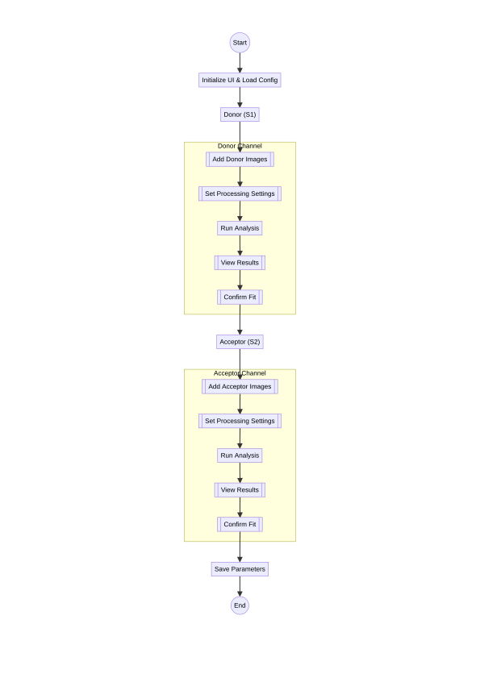
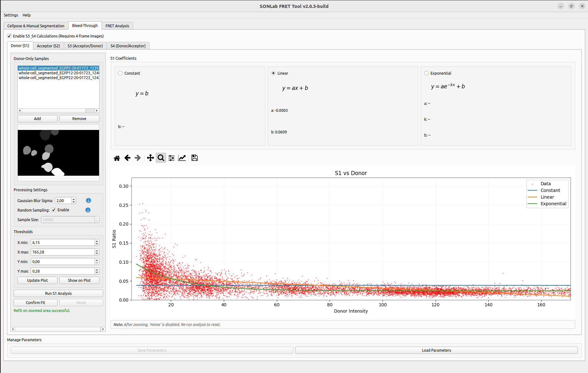
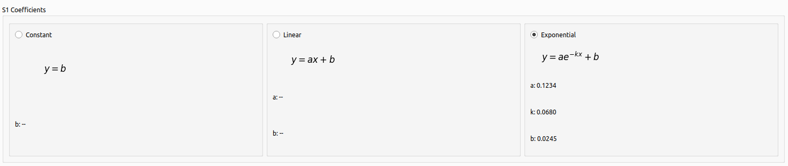

# Bleed-Through Correction

Spectral **bleed-through** (cross-talk) is the signal that leaks from the donor and acceptor fluorophores into the FRET detection channel. It must be measured and removed before FRET efficiency can be calculated accurately. The Bleed-Through tab estimates the bleed-through coefficients from **single-label control images** and fits a correction model that the FRET tab then applies.

  

*Flow of the bleed-through stage, from loading control images to saving the fitted coefficients.*

*The Donor (S1) channel: control-image list and processing settings on the left, the coefficient/fit-model panel on top, and the S1-vs-Donor scatter plot with the Constant/Linear/Exponential fits below.*

---

## Channels (sub-tabs)

The tab contains up to four channel sub-tabs:

| Sub-tab | Coefficient | Control sample | Required |
|---------|-------------|----------------|----------|
| **Donor (S1)** | Donor → FRET bleed-through | donor-only | Always |
| **Acceptor (S2)** | Acceptor → FRET bleed-through | acceptor-only | Always |
| **S3 (Acceptor/Donor)** | Acceptor-channel cross term | donor-only (4-frame) | Optional |
| **S4 (Donor/Acceptor)** | Donor-channel cross term | acceptor-only (4-frame) | Optional |

S3 and S4 are enabled with the **Enable S3 & S4 Calculations (Requires 4-frame images)** checkbox and are only meaningful when your images contain four frames (mask, FRET, Donor, Acceptor).

---

## Workflow

1. Select a channel sub-tab (start with **Donor (S1)**).
2. Add the appropriate single-label control images.
3. Configure the processing settings.
4. Run the analysis to compute the bleed-through ratio and fit it.
5. Choose the fitting model and confirm the fit.
6. Repeat for the Acceptor (S2) channel (and S3/S4 if enabled).
7. Save the parameters for reuse.

---

## 1. Load control images

- Click **Add**, or drag & drop `.tif`/`.tiff` files onto the list.
- A **preview** of the selected image's first frame is shown.
- Use **Remove** to drop images. When the list becomes empty, the preview, plot, and coefficients are cleared automatically.

> Use **donor-only** samples for S1/S3 and **acceptor-only** samples for S2/S4. These should be the segmented stacks produced in the **[[Segmentation]]** tab (or sent there via *Send to Donor / Send to Acceptor*).

---

## 2. Processing settings

| Setting | Default | Description |
|---------|---------|-------------|
| **Gaussian Blur Sigma** | `2.0` | Standard deviation of the Gaussian smoothing kernel applied before computing ratios; reduces pixel noise. |
| **Random Sampling ▸ Enable** | off | When enabled, the fit uses a random subset of pixels instead of all of them — much faster on large datasets. |
| **Sample Size** | `10000` | Number of pixels to sample when Random Sampling is enabled. |

---

## 3. Run the analysis

- Click **Run Analysis** for the channel.
- The tool processes the images (inside the segmentation mask only) and shows a **scatter plot** of the bleed-through ratio versus intensity, together with the fitted curve(s).
- Review the fit visually. If the relationship is concentrated in one region, use the plot toolbar's **zoom** to focus, or restrict the data with the threshold controls (below) and click **Update Plot**.

> **Note:** after zooming, the toolbar's *Home* button is disabled. Re-run the analysis (or use the threshold *Update Plot*) to reset the view.

---

## 4. Thresholds (optional)

The **Thresholds** panel restricts which data points are used for the fit:

- **X min / X max** — intensity range.
- **Y min / Y max** — ratio range (0–1).
- **Update Plot** — re-fits using only the points inside the thresholds.
- **Show on Plot** — draws the threshold lines on the scatter plot.

This is useful for excluding saturated pixels or low-signal noise before fitting.

---

## 5. Choose the fitting model

Three models are available; select one with its radio button. The fitted coefficients are displayed for each.

| Model | Equation | When to use |
|-------|----------|-------------|
| **Constant** | `y = b` | Bleed-through is essentially intensity-independent. |
| **Linear** | `y = a·x + b` | Bleed-through varies linearly with intensity. |
| **Exponential** | `y = a·e^(−k·x) + b` | Bleed-through changes non-linearly with intensity. The curve decays by default, so a **growing** relationship yields a negative `k`. |

When satisfied, click **Confirm Fit** to lock the coefficients for this channel so they can be used in FRET calculations. **Reset** unlocks the controls for a new analysis or refit.

*The coefficient panel: Constant (`y = b`), Linear (`y = ax + b`), and Exponential (`y = ae^(−kx) + b`). Here Exponential is selected and its fitted coefficients (a, k, b) are shown.*

---

## 6. Save and load parameters

In the **Manage Parameters** panel:

- **Save Parameters** writes the model type and coefficients of all channels to `bt_params.json` in the default location. It **also writes a copy into each input image directory** so the parameters stay alongside the data they describe; if a file already exists there, you are asked whether to overwrite it.
- **Load Parameters** restores a previously saved file. On startup the tool offers to reload the last session's parameters automatically.

Loading parameters while an analysis is already on screen re-draws the plot from the **saved** coefficients (it does not silently re-fit), so confirmed values are preserved exactly.

---

## Output and results

For each channel you get:
- A scatter plot of the data with the selected fit overlaid.
- The calculated coefficients for each model.
- Interactive zoom/pan controls.
- Status messages indicating fit availability and quality.

The confirmed coefficients flow into the **[[FRET Analysis]]** tab. See **[[Workflows and Data Flow]]**.

---

## Troubleshooting

| Symptom | Try this |
|---------|----------|
| Poor fit | Try a different model, or adjust the Gaussian Blur Sigma. |
| Slow performance | Enable Random Sampling with a smaller Sample Size. |
| No data points | Confirm the images are single-label controls in the correct channel and contain a segmentation mask. |
| Fit/plot not updating | Click the plot toolbar's *Home*, use threshold **Update Plot**, or re-run the analysis. |
| "S3 requires 4-frame images" | Provide 4-frame stacks (mask, FRET, Donor, Acceptor) when S3/S4 is enabled. |
