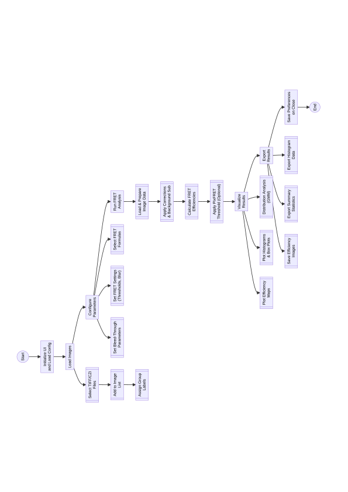
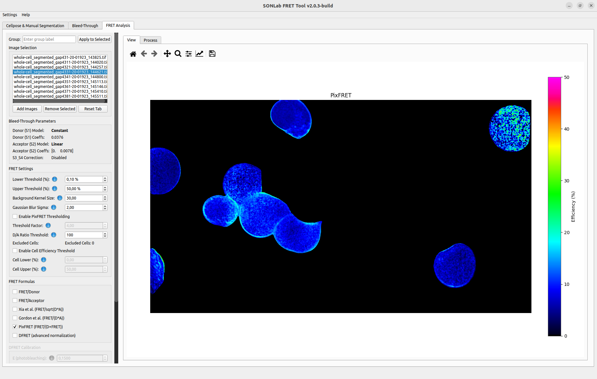
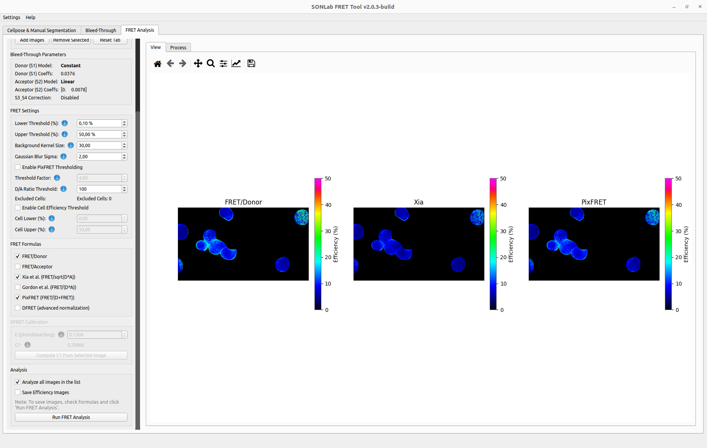

# FRET Analysis

The FRET Analysis tab computes pixel-wise FRET efficiency from segmented, bleed-through-corrected images, organizes images into experimental groups, and produces statistics and figures. This page covers loading data and configuring/running the analysis; the outputs are described in **[[Results and Visualization]]**.

  

*Flow of the FRET stage, from loading segmented images to exporting results.*

*The FRET Analysis tab: image list/grouping, the bleed-through parameters, FRET settings, and formula selection on the left; a color-coded efficiency map on the right.*

---

## Workflow

1. Add segmented images (from the **[[Segmentation]]** tab or disk).
2. Confirm the bleed-through parameters carried over from the **[[Bleed-Through Correction]]** tab.
3. Set the FRET thresholds and any optional filters.
4. Select one or more FRET formulas.
5. (Optional) Calibrate DFRET.
6. Assign groups for comparison.
7. Run the analysis and review the results.

---

## 1. Image selection & grouping

The **Image Selection** panel manages the images to analyze.

- **Add Images** — load one or more segmented `.tif`/`.tiff` (or `.czi`) stacks.
- **Remove Selected** — remove images from the list. When the list empties, every plot and table is cleared.
- **Reset Tab** — clear all images, results, and displays and start fresh.
- **Group assignment** — choose a group name and click **Apply to Selected** to tag the highlighted images. Groups drive the comparative statistics (e.g. control vs. treatment) across the rest of the tab.

> Images sent from the segmentation tab via *Send to FRET* or *Batch Segment && Transfer* arrive here automatically, optionally pre-tagged with a group.

---

## 2. Bleed-Through parameters

The **Bleed-Through Parameters** panel shows the correction model currently in effect:

- **Donor model / coefficients**
- **Acceptor model / coefficients**
- **S3 / S4 status** (Enabled or Disabled)

These are populated from the confirmed fits in the **[[Bleed-Through Correction]]** tab (or from a loaded `bt_params.json`). They are applied automatically when the analysis runs. If they read *N/A*, return to the Bleed-Through tab, confirm the fits, and save the parameters.

---

## 3. FRET settings

| Setting | Default | Description |
|---------|---------|-------------|
| **Lower Threshold (%)** | `0` | Minimum efficiency shown on the maps. |
| **Upper Threshold (%)** | `50` | Maximum efficiency shown on the maps (values above are clamped in the display). |
| **Background Kernel Size** | `30` | Kernel size for local background subtraction. |
| **Gaussian Blur Sigma** | `2.0` | Sigma for an optional Gaussian blur; set to `0` to disable. |

> The display thresholds affect the **visualized** maps. The statistics tables report both a true non-zero average (over all non-zero pixels) **and** a separate thresholded average — see **[[Results and Visualization]]**.

### Optional: PixFRET thresholding

Enable **Enable PixFRET Thresholding** to apply an intensity-based mask using:
- **Threshold Factor** (default `1.0`) — multiplier for the PixFRET threshold calculation, together with the background kernel and Gaussian sigma above.

### Optional: Cell efficiency threshold

Enable **Enable Cell Efficiency Threshold** to exclude whole cells whose mean efficiency falls outside a range:
- **Cell Lower (%)** — exclude cells with a mean efficiency below this value.
- **Cell Upper (%)** — exclude cells with a mean efficiency above this value.

This removes outlier cells (e.g. saturated or non-expressing) from the aggregate statistics.

---

## 4. FRET formulas

Select one or more formulas in the **FRET Formulas** panel; each selected formula produces its own efficiency map and statistics. Here `F`, `D`, and `A` are the corrected FRET, Donor, and Acceptor intensities.

| Formula | Expression | Notes |
|---------|------------|-------|
| **FRET/Donor** | `F / D` | Basic donor-normalized ratio. |
| **FRET/Acceptor** | `F / A` | Acceptor-normalized ratio. |
| **Xia et al.** | `F / √(D·A)` | Accounts for both donor and acceptor contributions. |
| **Gordon et al.** | `F / (D·A)` | Alternative dual normalization. |
| **PixFRET** | `F / (D + F)` | Common for sensitized-emission FRET. |
| **DFRET** | advanced normalization | Calibrated, photobleaching-anchored efficiency (see below). |

*Multiple formulas can be computed at once; each selected formula (here FRET/Donor, Xia, and PixFRET) produces its own efficiency map for side-by-side comparison.*

---

## 5. DFRET calibration (optional)

DFRET applies an advanced normalization (after Hochreiter et al.) that anchors efficiency to a photobleaching measurement. Configure it in the **DFRET Calibration** panel:

- **E (photobleaching)** — the FRET efficiency (0–1) determined from a donor–acceptor fusion construct by photobleaching. Required when DFRET is enabled.
- **C1** — the donor normalization factor (Eq. 6 in Hochreiter et al.).
- **Compute C1 from Selected Image** — derives `C1` automatically from the currently selected fusion-construct image, given a valid `E`.

> DFRET requires a positive `E` value to proceed. If it is missing, the tool prompts you to enter one.

---

## 6. Run the analysis

In the **Analysis** panel:

- **Analyze all images in the list** — when checked, every loaded image is processed; otherwise only the selected image is analyzed.
- **Run FRET Analysis** — executes the calculation with the current settings, applying the bleed-through correction and producing efficiency maps, statistics, and plots.

After the run, explore the outputs as described in **[[Results and Visualization]]**.

---

## Troubleshooting

| Symptom | Try this |
|---------|----------|
| BT parameters show *N/A* | Confirm and save the fits in the Bleed-Through tab. |
| DFRET refuses to run | Enter a positive **E** value, or compute **C1** from a fusion image. |
| Maps look empty | Check the Lower/Upper thresholds and that the images contain a segmentation mask (frame 0). |
| All cells excluded | Loosen the **Cell Efficiency Threshold** range or disable it. |
| Unexpected efficiency values | Verify the channel order of the input stack (mask, FRET, Donor, Acceptor) — see **[[File Formats]]**. |
