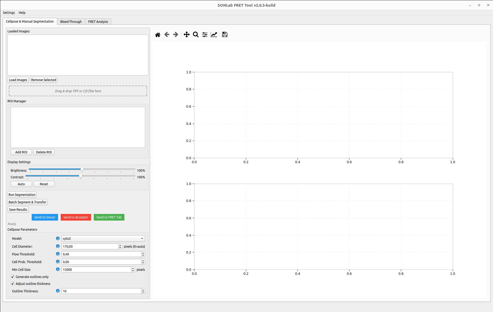

# SONLab FRET Analysis Tool — User Guide

Welcome to the official user guide for the **SONLab FRET Analysis Tool**, an open-source desktop application for analyzing Fluorescence Resonance Energy Transfer (FRET) microscopy data. It combines deep-learning cell segmentation (Cellpose) with standardized pipelines for bleed-through correction and FRET efficiency calculation, so that protein–protein interaction studies can be performed reproducibly and with minimal manual bias.

*The main window, shown on the Cellpose & Manual Segmentation tab.*

---

## What the tool does

The application is organized as a three-stage pipeline, one tab per stage:

1. **Cellpose & Manual Segmentation** — detect and segment cells, refine the result by hand, and forward the segmented stacks to the next stages.
2. **Bleed-Through** — measure the spectral cross-talk coefficients (S1–S4) from single-label control images and fit a correction model.
3. **FRET Analysis** — compute pixel-wise FRET efficiency with the corrected data, group images by condition, and produce publication-ready statistics and figures.

A typical session moves left-to-right through these tabs. See **[[Workflows and Data Flow]]** for the end-to-end picture.

---

## Guide contents

| Page | What you will find |
|------|--------------------|
| **[[Installation]]** | Installer and manual setup for Windows, Linux, and macOS |
| **[[User Interface Overview]]** | The main window, tabs, menus, theming, and the walkthrough |
| **[[Segmentation]]** | Loading images, Cellpose parameters, running, manual ROI editing, and transfer |
| **[[Bleed-Through Correction]]** | Channels S1–S4, processing settings, fitting models, save/load parameters |
| **[[FRET Analysis]]** | FRET settings, formulas, DFRET calibration, grouping, and running the analysis |
| **[[Results and Visualization]]** | Efficiency maps, statistics tables, histograms, box plots, and the statistics engine |
| **[[Workflows and Data Flow]]** | How data moves between tabs, recommended end-to-end workflows |
| **[[File Formats]]** | Input and output file structures (TIFF frame layout, JSON, CSV) |
| **[[Troubleshooting and FAQ]]** | Common problems and their solutions |

---

## At a glance

- **Inputs:** multi-frame `.tif`/`.tiff` and Zeiss `.czi` images containing FRET, Donor, and Acceptor channels.
- **Segmentation:** Cellpose models (`cyto2`, `cyto`, `nuclei`, `tissuenet`, `livecell`) with manual polygon refinement.
- **Bleed-through:** donor (S1), acceptor (S2) and optional S3/S4 channels; Constant, Linear, or Exponential fit.
- **FRET formulas:** FRET/Donor, FRET/Acceptor, Xia et al., Gordon et al., PixFRET, and DFRET.
- **Statistics:** assumption-checked significance testing (Welch / non-parametric) with per-group comparisons.
- **Outputs:** efficiency maps (TIFF), statistics (CSV), figures (PNG/PDF), and reusable parameter files (JSON).

---

## Citation

If you use this tool in your research, please cite:

> Nursoy, A. Z., Cevheroğlu, O., & Son, Ç. D. *Automated FRET Analysis for Enhanced Characterization of Protein–Protein Interactions.* Microscopy Research and Technique. https://doi.org/10.1002/jemt.70147

## Support

- Open an issue or start a discussion on the project's GitHub repository.
- Email: `sonlab@metu.edu.tr`
