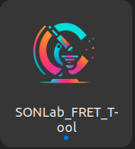

# Installation

There are two ways to install the SONLab FRET Analysis Tool:

1. **Using the installers (recommended)** — automated setup with a desktop launcher.
2. **Manual installation** — for advanced users who want full control of the environment.


*The desktop launcher created by the installer.*

---

## 1. Installers (recommended)

The `installers/` directory in the repository contains a script for each platform that creates a virtual environment, installs dependencies, and adds a desktop launcher.

| Platform | Script |
|----------|--------|
| Windows | `installers/install_windows.ps1` |
| Linux | `installers/install_linux.sh` |
| macOS | `installers/install_mac.sh` |

See `installers/README.md` for step-by-step instructions specific to each platform.

---

## 2. Manual installation

### Prerequisites

**All platforms**
- **Python 3.10** — required for dependency compatibility. Download [Python 3.10.11](https://www.python.org/downloads/release/python-31011/) and enable *Add Python to PATH* during installation. Newer Python versions are **not** supported because of dependency constraints.
- `pip` (Python package manager)
- Git (or download the repository as a ZIP)
- At least **8 GB** free disk space and an internet connection

**Linux (additional):** build tools and Python development headers.
**macOS (additional):** Xcode Command Line Tools; Homebrew is recommended for installing Python.

### Steps

**1. Get the source**
```bash
git clone https://github.com/sonlab-metu/SONLab-FRET-Tool.git
cd SONLab-FRET-Tool
```

**2. Create and activate a virtual environment**

Windows (Command Prompt):
```cmd
python -m venv venv
.\venv\Scripts\activate
```

Linux/macOS:
```bash
python3 -m venv venv
source venv/bin/activate
```

**3. Install the core dependencies**
```bash
pip install -r installers/requirements.txt
```

**4. Install PyTorch for your hardware**

Choose the command that matches your compute platform:

| Hardware | Command |
|----------|---------|
| NVIDIA (CUDA 11.8) | `pip install torch torchvision torchaudio --index-url https://download.pytorch.org/whl/cu118` |
| NVIDIA (CUDA 12.6) | `pip install torch torchvision torchaudio --index-url https://download.pytorch.org/whl/cu126` |
| NVIDIA (CUDA 12.8) | `pip install torch torchvision torchaudio --index-url https://download.pytorch.org/whl/cu128` |
| AMD ROCm 6.3 (Linux) | `pip install torch torchvision torchaudio --index-url https://download.pytorch.org/whl/rocm6.3` |
| CPU only | `pip install torch torchvision torchaudio --index-url https://download.pytorch.org/whl/cpu` |

On Apple Silicon, use the standard CPU command; PyTorch automatically uses the Metal Performance Shaders (MPS) backend.

**5. Run the application**
```bash
python3 -m GUI.main_gui
```

> **Note:** the manual method does not create a desktop shortcut. Activate the virtual environment and run the command each time.

---

## System recommendations

- Windows 10/11, macOS 10.15+, or a recent Linux distribution.
- Minimum 8 GB RAM (16 GB recommended for large datasets or batch processing).
- A CUDA-capable GPU significantly speeds up Cellpose segmentation but is not required.
- Screen resolution of 1920×1080 or higher is recommended for the multi-panel layout.

If you run into problems, see **[[Troubleshooting and FAQ]]**.
