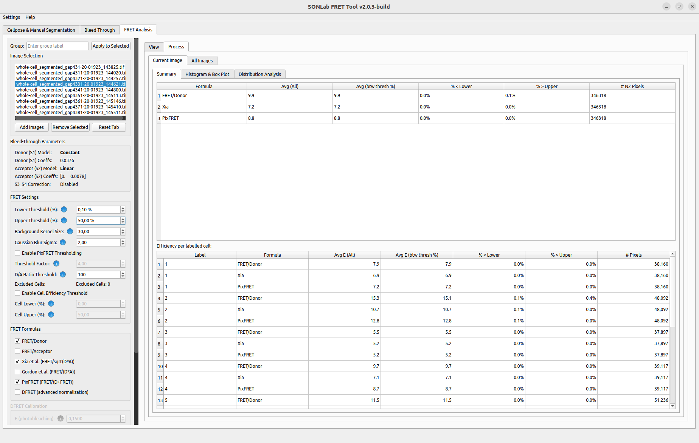
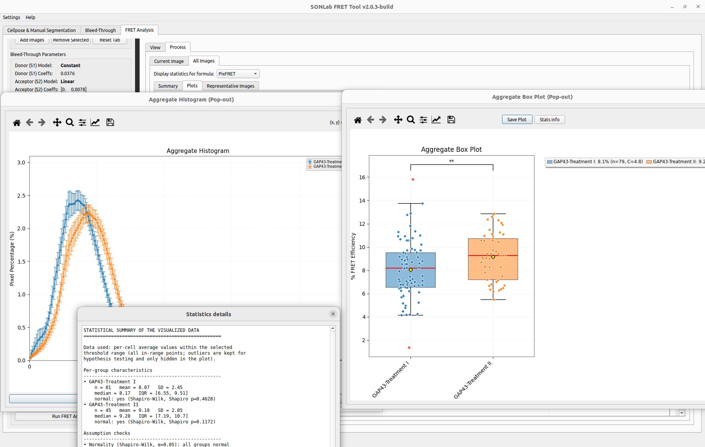
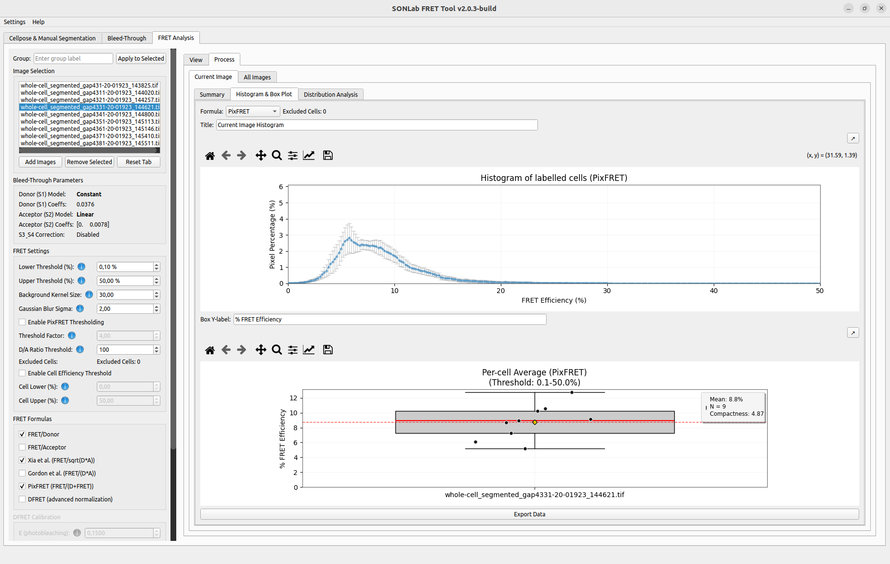
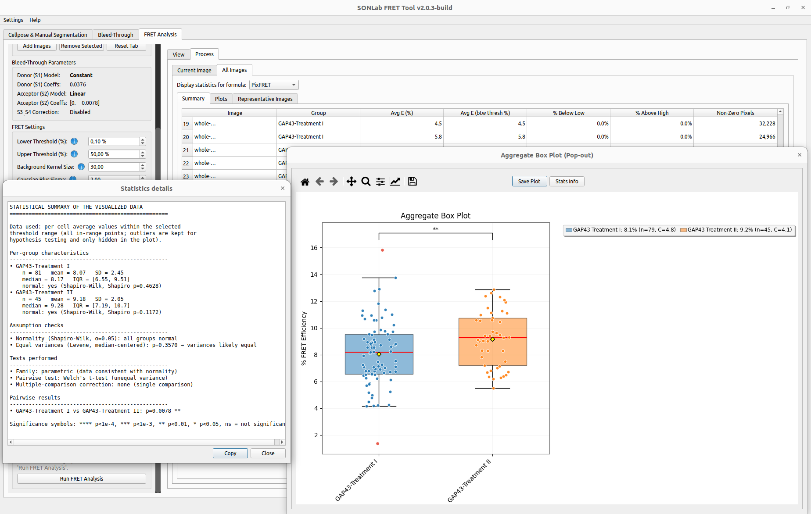
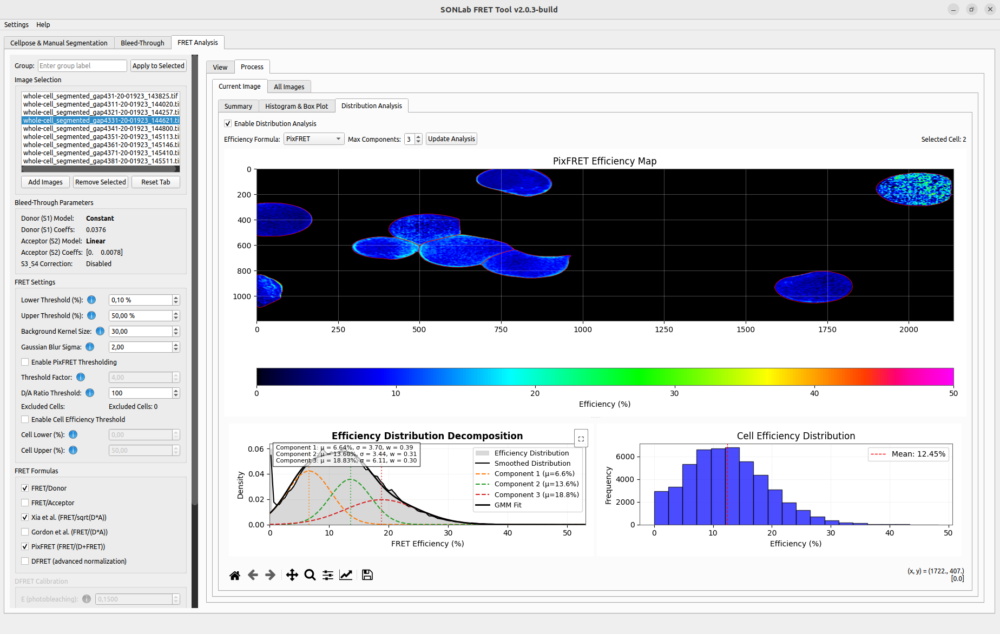

# Results and Visualization

After running the analysis (see **[[FRET Analysis]]**), the FRET tab presents efficiency maps, per-cell and per-image statistics, histograms, and box plots, both for the **current image** and **aggregated across all images and groups**. This page explains each output and the statistics behind it.

The results panel has two **View** levels — **Current Image** and **All Images** — each with **Summary**, **Histogram & Box Plot**, and **Distribution Analysis** sub-tabs.

*Current Image ▸ Summary: the per-formula statistics table (top) and the per-cell breakdown (bottom).*

---

## Efficiency maps

Each selected FRET formula is rendered as a color-coded efficiency map of the current image, scaled to the **Lower/Upper thresholds** set in the FRET settings. Values above the upper threshold are clamped to the top of the color scale for display. Use the matplotlib toolbar to zoom/pan, the **↗ pop-out** button to open a larger window, and **Save** to export the figure.

---

## Statistics tables

### Current image

A per-formula summary table with the columns:

| Column | Meaning |
|--------|---------|
| **Avg (All)** | Mean efficiency over **all non-zero** pixels of the cells, independent of the display threshold. |
| **Avg (btw thresh %)** | Mean efficiency over pixels **within** the Lower–Upper threshold range. |
| **% < Lower** | Percentage of non-zero pixels below the lower threshold. |
| **% > Upper** | Percentage of non-zero pixels above the upper threshold. |
| **# NZ Pixels** | Number of non-zero pixels. |

A second **per-cell (binned)** table breaks the same metrics down by individual cell label.

> **Avg (All) vs Avg (btw thresh):** these are deliberately distinct. *Avg (All)* is the true non-zero mean across the full data; *Avg (btw thresh)* restricts to the display window. They differ whenever cells contain pixels outside the threshold range, which is exactly what makes the below/above percentages meaningful.

### All images (aggregate)

An aggregate table summarizes every analyzed cell across all images:

| Column | Meaning |
|--------|---------|
| **Image / Group** | Source image and its assigned group. |
| **Avg E (%)** | Non-zero average efficiency. |
| **Avg E (btw thresh %)** | Thresholded average efficiency. |
| **% Below Low / % Above High** | Out-of-threshold percentages. |
| **Non-Zero Pixels** | Pixel count. |

Aggregate results can be exported to CSV for downstream analysis.

*All Images ▸ Plots: the aggregate histogram and box plot (shown popped out) compare groups across every analyzed image, with a statistics summary alongside.*

---

## Histograms and box plots

- **Histogram** — distribution of efficiency values; the aggregate version averages per-cell histograms and shows an error band.
- **Box plot** — distribution of per-cell average efficiencies. The aggregate box plot places **groups** side by side for comparison.
- **SEM / SD toggle** — choose whether error bands/bars represent the standard error of the mean or the standard deviation.
- Titles and axis labels are editable, and every plot has **↗ pop-out** and **Save** controls for publication-quality export.

*Current Image ▸ Histogram & Box Plot: the efficiency histogram of labelled cells and the per-cell average box plot, each with editable titles and pop-out/save controls.*

---

## Statistical significance testing

When two or more groups are compared, the tool draws significance bars between them and chooses the test **from the data** rather than always using the ordinary (normality-assuming) forms:

- Each group is screened for normality (Shapiro–Wilk).
- **If all groups look normal** → parametric tests: **Welch's t-test** for pairs (robust to unequal variances) and **Welch's ANOVA** as the omnibus test for >2 groups.
- **If any group departs from normality** → non-parametric tests: **Mann–Whitney U** for pairs and **Kruskal–Wallis** as the omnibus test.
- For more than two groups, post-hoc pairwise comparisons are corrected with **Holm–Bonferroni**, and are only reported when the omnibus test is significant.

### Significance symbols

| Symbol | Meaning |
|--------|---------|
| `****` | p < 0.0001 |
| `***` | p < 0.001 |
| `**` | p < 0.01 |
| `*` | p < 0.05 |
| `ns` | not significant |

### Stats info dialog

Click **Stats info** (or the **Stats ℹ** button) on a box plot to open a read-only dialog summarizing exactly how the result was produced: per-group descriptive statistics (n, mean, SD, median, IQR), the normality and equal-variance checks, the test family chosen, the omnibus result, and each pairwise comparison. The summary can be copied to the clipboard.

*The aggregate box plot comparing two groups, with the Statistics details dialog reporting the descriptive statistics, assumption checks, the chosen test, and the pairwise result.*

---

## Distribution analysis (Gaussian-mixture decomposition)

The **Distribution Analysis** sub-tab decomposes a cell's efficiency distribution into Gaussian components, which helps reveal sub-populations within a cell or condition.

1. Tick **Enable Distribution Analysis**.
2. Choose the **Efficiency Formula** and the **Max Components** (1–5, default 3) to fit.
3. Click **Update Analysis**.
4. Click a cell on the efficiency map to select it; the *Selected Cell* label updates.

The panel shows the efficiency map, the **Gaussian Mixture Model decomposition** of the selected cell's efficiency distribution (the smoothed distribution and its individual Gaussian components), and the cell efficiency distribution histogram.

*Distribution Analysis: the efficiency map (top), the Gaussian-mixture decomposition of the efficiency distribution (bottom left), and the cell efficiency distribution (bottom right).*

---

## Representative images

Use **Find Rep Image** to automatically pick the image whose efficiency distribution best represents its group — handy for choosing figures for publication. Select the target group first, then run the finder.

---

## Exporting results

| Output | How |
|--------|-----|
| Efficiency maps (TIFF) | Enable efficiency saving before running the analysis. |
| Statistics (CSV) | Export from the aggregate statistics table. |
| Figures (PNG/PDF) | **Save** button on any plot or its pop-out window. |

See **[[File Formats]]** for the structure of the exported files.
