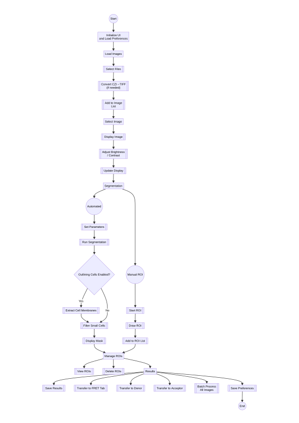
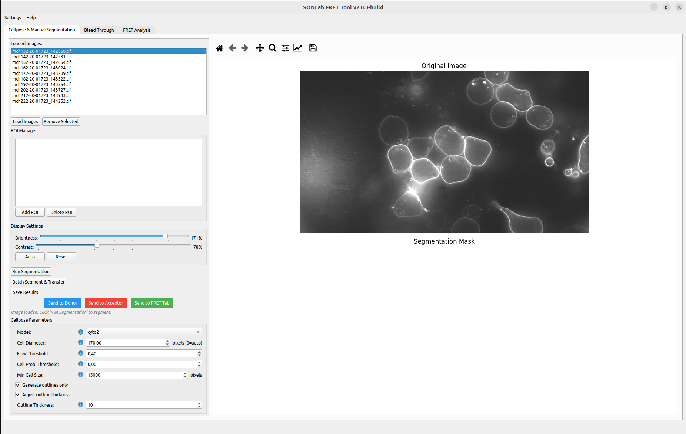
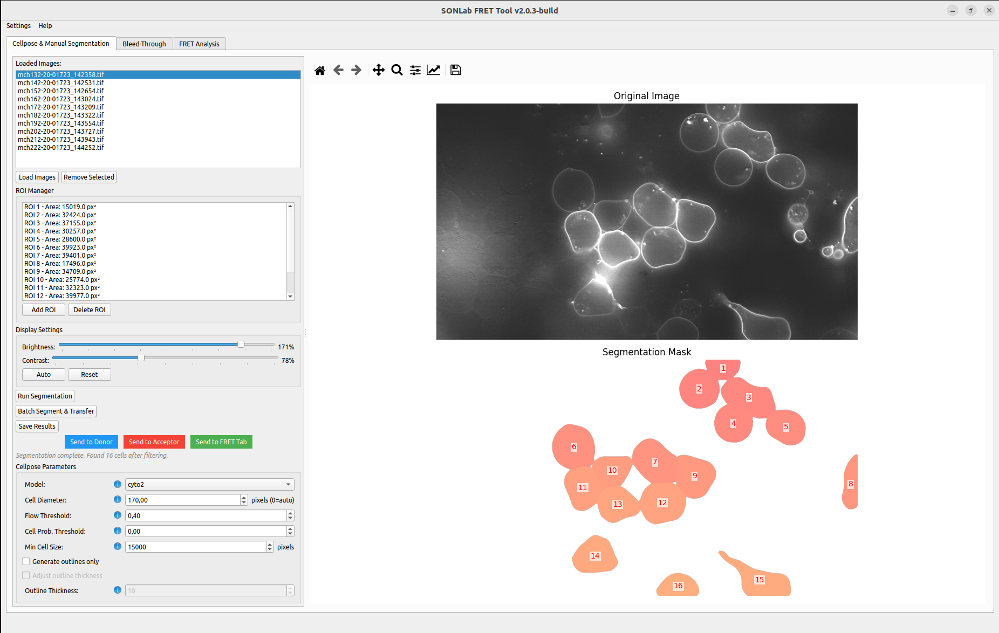
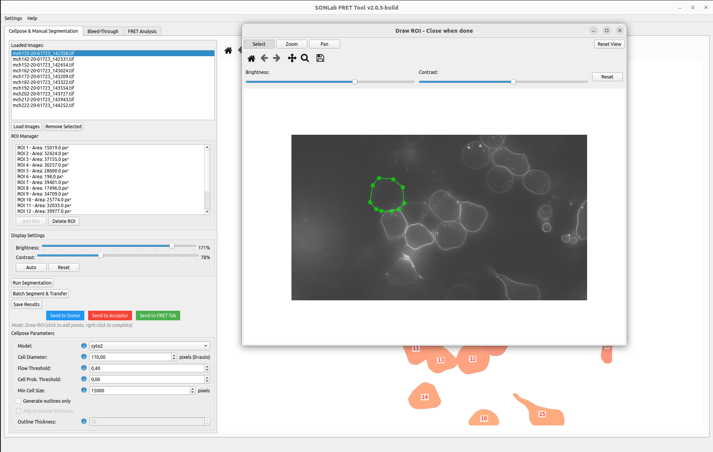

# Cellpose & Manual Segmentation

The first tab detects and segments cells using the [Cellpose](https://www.cellpose.org/) deep-learning models, lets you refine the result by hand with polygon ROIs, and forwards the segmented image stacks to the Bleed-Through and FRET tabs.

Segmentation produces a **label mask** — an image where every pixel of a given cell shares the same integer label (1, 2, 3, …) and background is 0. This mask is stored as the first frame of the saved stack and is what every downstream calculation uses to know which pixels belong to which cell.

  

*Flow of the segmentation stage, from loading images to transferring the segmented stacks.*

*The Segmentation tab: image list and Cellpose parameters on the left; the original image and the (empty) segmentation mask area on the right.*

---

## 1. Load images

- Click **Load Images** to choose one or more files, or **drag & drop** them onto the *Drag & drop TIFF or CZI files here* area.
- Supported inputs: multi-frame `.tif` / `.tiff` and Zeiss `.czi`.
- CZI files are converted automatically to a multi-frame TIFF (FRET, Donor, Acceptor) on load. See **[[File Formats]]** for the frame layout.
- Loaded files appear under **Loaded Images**. Select an item to display it. Use **Remove Selected** to drop images; when the list becomes empty the view returns to a blank state.

---

## 2. Cellpose parameters

Found in the **Cellpose Parameters** panel. Hover the ⓘ icon next to each control for an inline reminder.

| Parameter | Default | Range | Description |
|-----------|---------|-------|-------------|
| **Model** | `cyto2` | `cyto2`, `cyto`, `nuclei`, `tissuenet`, `livecell` | The Cellpose model. `cyto2` works well for most whole-cell segmentation tasks; use `nuclei` for nuclear stains. |
| **Cell Diameter** | `170` px | 0–500 | Approximate cell diameter in pixels. Set to **0** for automatic estimation. Matching this to your data is the single most impactful parameter. |
| **Flow Threshold** | `0.4` | 0.1–1.0 | Maximum allowed flow error per mask. Lower values are stricter (fewer, cleaner masks); higher values recover more cells but may add spurious ones. |
| **Cell Prob. Threshold** | `0.0` | −6.0–6.0 | Detection probability cut-off. Lower values detect more (including faint) cells but admit more noise; raise it to keep only confident detections. |
| **Min Cell Size** | `15000` px | 1–100000 | Objects smaller than this (in pixels) are removed after segmentation. |
| **Generate outlines only** | on | — | When checked, the mask stores cell **outlines** instead of filled regions. Output files are prefixed `outline_segmented_`; otherwise `whole-cell_segmented_`. |
| **Adjust outline thickness** | on | — | Enables the thickness control below. |
| **Outline thickness** | `10` | 1–20 | Thickness (in pixels) of generated outlines. |

> **Tip:** if cells are merged together (under-segmentation), reduce the **Cell Diameter** or lower the **Flow Threshold**. If single cells are split into pieces (over-segmentation), increase the diameter. Remove debris by raising **Min Cell Size**.

---

## 3. Display settings

These affect only the on-screen preview, never the saved data.

- **Brightness** and **Contrast** sliders adjust the displayed image.
- **Auto** automatically optimizes brightness/contrast.
- **Reset** restores the default display.

---

## 4. Run segmentation

- **Run Segmentation** segments the currently selected image and overlays the detected cells.
- The status line (e.g. *Ready*) reports progress and the number of cells found.

*After Run Segmentation: detected cells appear as numbered labels in the mask panel, and the ROI Manager list is populated with one entry per cell.*

---

## 5. Manual refinement — ROI Manager

After (or instead of) automatic segmentation, refine the mask by hand using the **ROI Manager** panel.

- **Add ROI** — draw a custom polygon:
  1. Click **Add ROI**.
  2. Click on the image to place each polygon vertex.
  3. Close the polygon to finish. The new region is assigned the next available label number.
- **Delete ROI** — select a region in the ROI list and click **Delete ROI**.
- **ROI list** — shows every detected and manually added region with its label number.

Typical refinements:
- Add a missing cell by drawing a new ROI.
- Remove a wrongly segmented region by deleting its ROI.
- Split a merged cell by deleting its ROI and drawing separate ROIs for each cell.

**View navigation tools** (when available) — **Select**, **Zoom** (mouse wheel), **Pan**, and **Reset View** help you work precisely on the image; a separate **Brightness/Contrast/Reset** control adjusts the editing view.

*The ROI drawing window ("Draw ROI – Close when done"): click to place polygon vertices around a cell, using the Select/Zoom/Pan tools and brightness/contrast controls as needed.*

---

## 6. Save and transfer

Once the mask looks correct, choose how to forward it:

| Action | What it does |
|--------|--------------|
| **Save Results** | Saves the segmented stack to a `segmented/` folder next to the source image (mask as frame 0, then the original channels). |
| **Send to FRET Tab** | Saves and adds the segmented image directly to the FRET Analysis tab. |
| **Send to Donor** | Sends the current segmented image to the Bleed-Through **Donor (S1)** channel. |
| **Send to Acceptor** | Sends the current segmented image to the Bleed-Through **Acceptor (S2)** channel. |
| **Batch Segment && Transfer** | Segments **all** loaded images with the current parameters and transfers them to the FRET tab, optionally tagging them with a group name. |

> **Note on data fidelity:** the saved stacks preserve the original raw pixel intensities of every channel (no rescaling), so they can be used directly for bleed-through and FRET calculations.

---

## Output format

Segmentation results are saved as a **multi-frame TIFF** with:
- **Frame 0:** the segmentation label mask.
- **Frames 1…N:** the original image channels (FRET, Donor, Acceptor) in their original order.

Files are written to a `segmented/` directory beside the input image and prefixed `outline_segmented_` or `whole-cell_segmented_` depending on the *Generate outlines only* setting. See **[[File Formats]]** for full details.

---

## Troubleshooting

| Symptom | Try this |
|---------|----------|
| Cells merged together | Lower **Cell Diameter** or **Flow Threshold**. |
| Cells split into pieces | Increase **Cell Diameter**. |
| Debris / tiny specks segmented | Increase **Min Cell Size**. |
| Faint cells missed | Lower **Cell Prob. Threshold**. |
| Too many false detections | Raise **Cell Prob. Threshold** and/or lower **Flow Threshold**. |
| Polygon won't complete | Make sure the ROI has at least 3 points and is closed. |
| Segmentation very slow | Use a CUDA-capable GPU if available; otherwise reduce image size or batch size. |

Continue to **[[Bleed-Through Correction]]**.
