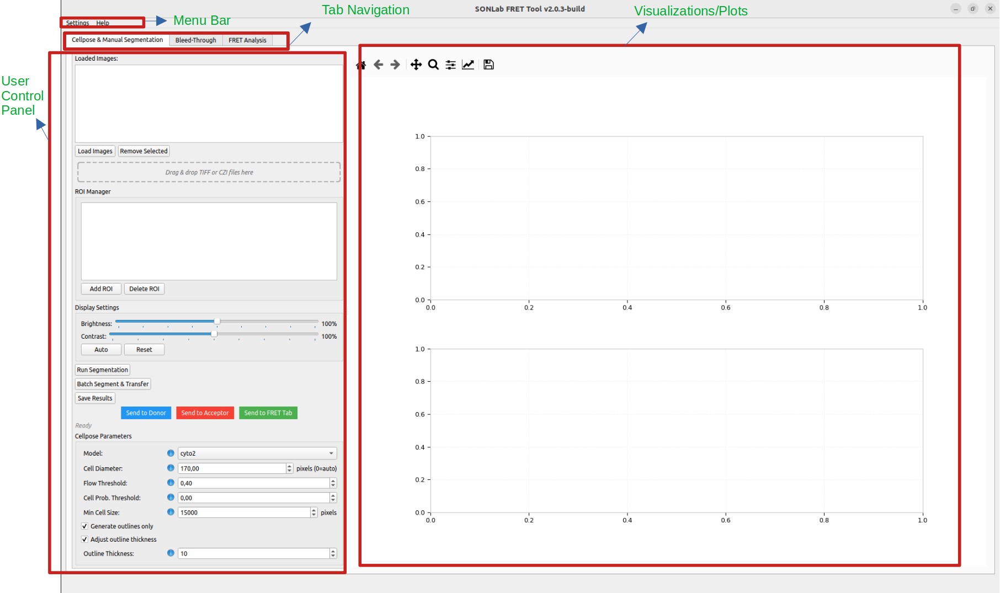
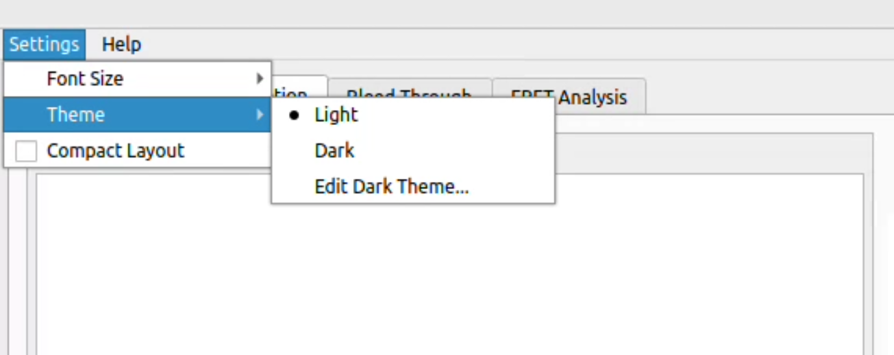
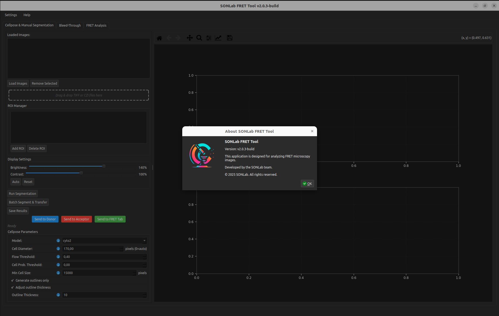
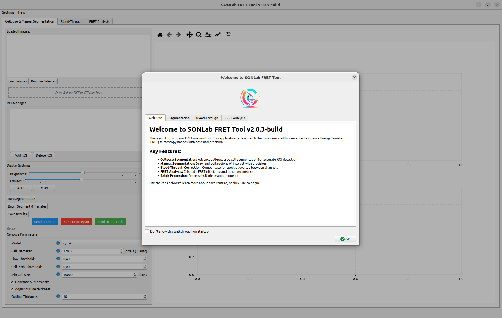

# User Interface Overview

This page describes the main window, how to move between the analysis modules, and the application-wide settings available from the menu bar.

*The four regions of the interface: the menu bar, the tab navigation, the left-hand user control panel, and the visualization/plots area.*

---

## Main window layout

The window is divided into three regions:

- **Menu bar** (top) — application settings and help.
- **Tab strip** — switches between the three analysis modules:
  - **Cellpose & Manual Segmentation**
  - **Bleed-Through**
  - **FRET Analysis**
- **Working area** — the controls and visualizations for the active tab. Most tabs use a left-hand control panel and a central/-right visualization area.

The window title shows the application name and version (for example, `SONLab FRET Tool v2.0.3-build`).

---

## Menu bar

### Settings

| Item | Description |
|------|-------------|
| **Font Size ▸ slider** | Adjusts the application-wide font size live with a slider. |
| **Font Size ▸ Reset** | Restores the default font size. |
| **Theme ▸ Light / Dark** | Switches between the light and dark color themes. |
| **Theme ▸ Dark Theme Editor** | Opens a dialog to customize the dark theme colors. |
| **Compact Layout** | Toggles a denser layout that reduces padding/margins — useful on smaller screens. |

*The Settings menu, with the Theme submenu (Light, Dark, Edit Dark Theme…) open.*

**Edit Dark Theme…** opens a color editor for customizing the dark palette. The dark theme applies to the whole application:

*The application in dark theme. The About dialog (Help ▸ About) shows the version and license information.*

### Help

| Item | Description |
|------|-------------|
| **Walk-through** | Opens a guided walkthrough with one page per pipeline stage: Welcome, Segmentation, Bleed-Through, and FRET Analysis. Available any time, even after dismissing it on startup. |
| **User Guide** | Opens this user guide. |
| **About** | Shows version, authorship, and license information. |

*The Help ▸ Walk-through dialog. Each tab introduces one stage of the pipeline; tick "Don't show… on startup" to skip it next launch.*

---

## Conventions used throughout the app

- **ⓘ Info icons** sit next to many controls. Hover over them to read a one-line description of what the control does.
- **Drag & drop** is supported on image lists — drop `.tif`, `.tiff`, or `.czi` files directly onto a tab to add them.
- **Mouse wheel** does **not** change the value of dropdowns or spin boxes anywhere in the app; this prevents accidental edits while scrolling. Click a field and type, or use the up/down arrows.
- **Pop-out (↗) buttons** open a plot in a larger, separate window with its own toolbar and save button.
- **Matplotlib toolbars** under plots provide zoom, pan, and save controls.

---

## Where to go next

- New to the tool? Start with **[[Segmentation]]** and follow the pipeline left to right.
- Want the big picture first? Read **[[Workflows and Data Flow]]**.
